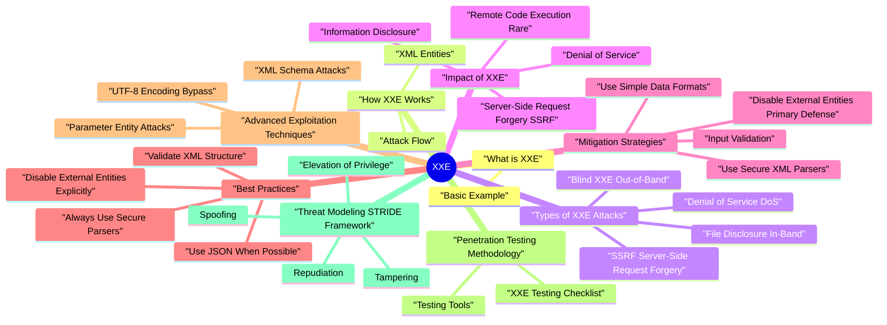

# XXE revision map

Last mock I bounced around the XXE folder. This file is the stop that. Drawn from Critical Clarification XXE Misconceptions.md, XXE (XML External Entity) - Comprehensive Guide.md, XXE - Interview Questions & Answers.md, XXE - Quick Reference.md, XXE - VAPT Methodology.md. Skim the mermaid, then the outline.

### What XXE is Used For
- Read local files from the server filesystem
- Perform SSRF attacks by making HTTP requests from the server
- Cause denial of service through entity expansion attacks
- Extract sensitive data from configuration files
- Access internal network resources via SSRF

### Why XXE is Dangerous
- High Impact: Can lead to complete file system access
- Common: Found in many XML processing applications
- Can lead to SSRF: May enable access to internal networks
- Hard to Detect: May not show obvious errors
- Widespread: Affects any application processing XML

## What is XXE

### Basic Example
- Result: Application reads and returns contents of /etc/passwd

## How XXE Works

### XML Entities
- Defined within the document
- Relatively safe (with proper validation)
- Reference external resources
- Can be dangerous if not restricted
- Used in DTD definitions
- Can be chained for complex attacks

### Attack Flow
- Parser reads DOCTYPE declaration
- Defines external entity xxe
- Resolves file:///etc/passwd URI
- Parser expands &xxe; entity
- Replaces with contents of /etc/passwd
- Includes sensitive file contents in response
- File contents returned in XML response
- Attacker extracts sensitive information

## Types of XXE Attacks

### File Disclosure (In-Band)
- Description: Attacker reads local files, with file contents returned directly in the response.

### SSRF (Server-Side Request Forgery)
- Description: Attacker makes the server perform HTTP requests to internal or external resources.
- Result: Server makes HTTP request to http://internal-server:8080/admin

### Blind XXE (Out-of-Band)
- Description: Attacker extracts data indirectly via external servers, when file contents aren't returned directly.
- Result: File contents sent to attacker's server via HTTP request

### Denial of Service (DoS)
- Description: Attacker causes entity expansion attacks (Billion Laughs attack) to exhaust server resources.
- Result: Massive entity expansion exhausts memory/CPU

## Impact of XXE

### Information Disclosure
- Read sensitive files (passwords, keys, configs)
- Access source code
- Extract database credentials
- /etc/passwd
- /etc/shadow
- Application configuration files
- Private keys
- Database credentials

### Server-Side Request Forgery (SSRF)
- Access internal services
- Port scanning
- Access cloud metadata APIs
- Internal network reconnaissance

### Denial of Service
- Server resource exhaustion
- Application unavailability
- Performance degradation
- Threat: Attacker causes DoS via entity expansion.
- Disable external entities
- Resource limits
- Entity expansion limits

### Remote Code Execution (Rare)
- In some cases, XXE can lead to RCE
- Often requires specific configurations
- More common in PHP applications

## Mitigation Strategies

### Disable External Entities (Primary Defense)
- See the source section `Disable External Entities (Primary Defense)` for the worked example.

### Use Secure XML Parsers
- defusedxml - Secure by default
- xml.etree.ElementTree - Vulnerable by default
- Configure DocumentBuilderFactory securely
- Default configurations vulnerable

### Input Validation
- See the source section `Input Validation` for the worked example.

### Use Simple Data Formats
- Use JSON instead of XML
- Use YAML (with safe loading)
- Avoid XML if not necessary

## Best Practices

### Always Use Secure Parsers
- See the source section `Always Use Secure Parsers` for the worked example.

### Disable External Entities Explicitly
- See the source section `Disable External Entities Explicitly` for the worked example.

### Validate XML Structure
- See the source section `Validate XML Structure` for the worked example.

### Use JSON When Possible
- See the source section `Use JSON When Possible` for the worked example.

## Advanced Exploitation Techniques

### Parameter Entity Attacks
- Technique: Use parameter entities to chain entity definitions.

### UTF-8 Encoding Bypass
- Technique: Use different encoding to bypass filters.

### XML Schema Attacks
- See the source section `XML Schema Attacks` for the worked example.

## Penetration Testing Methodology

### XXE Testing Checklist
- File uploads (Office docs, SVG images)
- SOAP endpoints
- REST APIs accepting XML
- Configuration file processing
- Check for file contents in response
- Monitor network traffic for outbound requests
- Check for error messages revealing file access

### Testing Tools
- XXE plugin
- Manual payload crafting
- Response analysis

## Threat Modeling (STRIDE Framework)

### Spoofing
- Threat: Attacker spoofs internal network requests via SSRF.
- Disable external entities
- Network segmentation
- Restrict outbound connections

### Tampering
- Threat: Attacker modifies XML structure to exploit parser.
- Input validation
- Secure parsers
- Whitelist XML structures

### Repudiation
- Threat: Actions via XXE cannot be attributed.
- Comprehensive logging
- Request correlation
- Audit trails

### Elevation of Privilege
- Threat: Attacker gains access to internal resources via SSRF.
- Disable external entities
- Network segmentation
- Least privilege

## Real-World Case Studies

### Case Study 1: File Disclosure in SOAP Endpoint
- Background: Penetration test discovered XXE in SOAP web service.
- Confidentiality: Critical - File system access
- Integrity: High - Could access configuration files
- Business Impact: Critical - Complete information disclosure

### Case Study 2: SSRF via XML Upload
- Background: Security assessment revealed XXE in file upload functionality.
- Attacker creates malicious Office document with XXE payload
- Uploads document
- Server processes XML, makes HTTP request to internal service
- Confidentiality: Critical - Internal network access
- Business Impact: Critical - SSRF to internal services

## Advanced Mitigations

### Defense in Depth Strategy
- Layer 1: Secure XML Parser (Primary Defense)
- Restrict outbound connections
- Network segmentation
- Firewall rules
- Least privilege file access
- Secure configuration files
- Read-only where possible

## Parser Hardening Nuances (Senior+)

### XXE-adjacent XML features to disable
- Teams often disable external entities but forget related parser features:
- XInclude processing
- External schema/DTD resolution (xsd:import, remote schema fetch)
- Entity expansion limits (DoS resilience)
- Dangerous transformation engines with network/file access

### Parser configuration drift across services
- Real systems parse XML in many places (API gateway, SAML library, document converter, background worker). Risk appears when one component is hardened and another is not.
- Maintain approved parser wrapper libraries per language/runtime.
- Ban direct parser construction in secure coding standards.
- Add SAST rules for unsafe parser instantiation APIs.
- Run integration tests that exercise every XML ingestion path.

### Egress controls as XXE blast-radius limiter
- Even if parser hardening fails, network controls can prevent impact:
- Block access to metadata/link-local/internal RFC1918 ranges from XML-processing workloads.
- Restrict outbound DNS/HTTP to allowlisted destinations.
- Alert on parser workloads initiating unexpected outbound connections.

## SAST/DAST Detection

### SAST (Static Application Security Testing)
- See the source section `SAST (Static Application Security Testing)` for the worked example.

### DAST (Dynamic Application Security Testing)
- Find endpoints accepting XML
- Identify file upload functionality
- Check SOAP endpoints
- Check for file contents
- Monitor network traffic
- Check for error messages
- Use out-of-band techniques
- Monitor external server for requests

## Risk Assessment

### Risk Matrix
- See the source section `Risk Matrix` for the worked example.

### Risk Calculation
- Requires XML processing
- Less common than other vulnerabilities
- Often overlooked
- File system access
- SSRF potential
- Data breach
- Financial: Data breach, regulatory fines
- Reputation: Loss of customer trust

## Interview clusters
- Fundamentals: "What is an external entity?" "XXE vs SSRF?"
- Senior: "How do you configure Java/.NET/Go XML parsers safely?"
- Staff: "SAML stack-where does XML parsing risk sit end-to-end?"

## Cross-links
- SSRF, SAML and Enterprise Federation, Secure Source Code Review, Dependency/supply chain for XML libraries.

## Flags I check in 90 seconds

## XXE Attack Types

### File Disclosure
- See the source section `File Disclosure` for the worked example.

### SSRF
- See the source section `SSRF` for the worked example.

### Blind XXE
- See the source section `Blind XXE` for the worked example.

### DoS (Billion Laughs)
- See the source section `DoS (Billion Laughs)` for the worked example.

## Secure XML Parsers

### Python
- See the source section `Python` for the worked example.

### Java
- See the source section `Java` for the worked example.

## XXE Protection Checklist
- Use secure XML parsers (defusedxml)
- Disable external entities
- Disable DOCTYPE declarations (when possible)
- Input validation (reject DOCTYPE)
- Use JSON when possible
- Restrict network access
- Secure file system permissions

## Common Vulnerable Locations
- SOAP endpoints
- REST APIs accepting XML
- File uploads (Office docs, SVG)
- Configuration file processing
- RSS/Atom feeds

## Risk Levels

## Tools
- Burp Suite: XXE plugin, manual testing
- Custom Scripts: Automated payload testing
- OWASP ZAP: Automated scanning

## Misreads that still sneak in

## ️ Common Misconceptions

### "XXE only affects XML parsers"
- Truth: XXE can affect any application that processes XML, not just dedicated XML parsers.
- XML parsers (obvious)
- SOAP endpoints
- REST APIs accepting XML
- File uploads (Office documents, SVG images)
- Configuration files
- Web services
- RSS/Atom feeds

### "Disabling external entities prevents XXE"
- Truth: Disabling external entities is necessary but not always sufficient. Some attacks use internal entities or parameter entities.
- Key Point: Disable external entities AND use secure XML parsers configured properly.

### "XXE only allows reading local files"
- Truth: XXE can lead to multiple attack vectors:
- Local File Disclosure (most common)
- Server-Side Request Forgery (SSRF)
- Denial of Service (DoS)
- Remote Code Execution (in some cases)
- Out-of-Band Data Exfiltration

### "JSON APIs are safe from XXE"
- Truth: JSON APIs can be vulnerable if they accept XML or process XML-based formats.
- API accepts both JSON and XML
- File uploads (Office docs contain XML)
- SVG images (XML format)
- SOAP endpoints (XML-based)

### "Modern XML parsers are secure by default"
- Truth: Many XML parsers are vulnerable by default and require explicit secure configuration.
- Key Point: Most XML parsers need explicit secure configuration. Don't assume defaults are safe.

## Key Takeaways

### Understanding
- XXE affects any XML processing, not just parsers
- Disabling external entities may not be enough - need secure configuration
- XXE can lead to SSRF, DoS, RCE, not just file reading
- JSON APIs can be vulnerable if they accept XML
- Most XML parsers are vulnerable by default - need secure configuration

### Common Mistakes
- Assuming only XML parsers are vulnerable
- Thinking disabling external entities is enough
- Believing XXE only reads files
- Assuming JSON APIs are safe
- Trusting default XML parser configurations

## Summary Table
- Remember: XXE vulnerabilities occur when XML parsers process external entities. Always use secure XML parsers with external entities disabled and network access restricted!

## Lab methodology

## Scope & XML Usage Overview
- Identify where XML is used:
- API endpoints accepting XML payloads (SOAP, REST, legacy integrations).
- File upload formats (XML configuration files, data imports, SAML, etc.).
- Third‑party integrations that rely on XML under the hood.
- Determine XML parsers & libraries:
- Programming language and framework.
- Default parser configurations (external entity resolution, DTD support).
- Trust boundaries:

## Mapping XML Entry Points
- Endpoints / features that consume XML:
- SOAP or REST endpoints with Content-Type: application/xml or similar.
- Uploads of XML‑based configuration or data files.
- Authentication or SSO flows using XML‑based tokens (e.g., SAML) - with extra care.
- Downstream usage:
- Where parsed XML data goes:
- Data storage.
- Configuration processing.

## Parser Configuration Analysis (White‑/Gray‑Box)
- Where code or configuration is accessible, review:
- Parser settings:
- Whether external entity resolution (XXE) is enabled or disabled.
- Whether DTDs are allowed.
- Limits on entity expansion, recursion, and resource consumption.
- Library defaults:
- Some older libraries are vulnerable by default.
- Modern libraries/frameworks often have safer defaults but can be misconfigured.

## Dynamic Testing - High‑Level Approach
- In a dedicated test environment where permitted:
- Craft benign XML variations:
- Include or omit DTD declarations.
- Use internal entities and observe parser behavior.
- Intentionally malformed XML to see error handling.
- Observe responses:
- Whether the application:
- Accepts or rejects XML with DTDs.

## Common XXE Risk Patterns
- Parsers configured with:
- External entity resolution enabled.
- DTDs allowed with no further restrictions.
- Application behavior such as:
- Accepting arbitrary user‑supplied XML without schema validation.
- Parsing XML from untrusted sources and passing it to sensitive components.
- Deserializing XML into complex object graphs without hardening.
- XML inputs that can influence:

## Tooling & Aids
- Proxy tooling:
- Capture and replay XML requests with controlled, benign modifications.
- Inspect server responses and error messages.
- XML editing tools:
- Editors that help you construct valid/invalid XML variants.
- Static analysis & configuration review:
- Search for parser instantiation points and their settings.
- Check framework or container configuration files for XML parsing options.

## Verifying Exploitability Safely
- In a test environment under coordination:
- Show that the parser:
- Processes DTDs or external entities when it should not.
- Attempts to access a harmless, test‑only local or network resource explicitly set up for this purpose.
- Observe logs or controlled output confirming that entity resolution occurred.
- Without directly accessing sensitive resources:
- Focus on proving that the configuration allows potentially dangerous behavior.
- Keep payloads and targets restricted to non‑sensitive test assets.

## Reporting & Risk Assessment
- XML entry point and purpose.
- Parser/library in use and its configuration.
- Conditions under which entities or DTDs are processed.
- Observed behaviors indicating:
- External entity resolution.
- Resource exhaustion risk.
- Unexpected file or network access attempts (in test).
- Potential impact in production:

## Remediation Guidance
- Recommend that developers and platform teams:
- Harden XML parsers:
- Disable external entity resolution.
- Disable DTD processing unless strictly required and safely controlled.
- Set reasonable limits on input size, entity expansion, and recursion.
- Use safe data formats where possible:
- Prefer JSON or other simpler formats for untrusted input when feasible.
- Apply schema validation:

## Re‑Testing Checklist
- [ ] Confirm that XML entry points:
- [ ] Reject or safely ignore DTDs and external entity declarations where unnecessary.
- [ ] Enforce size and complexity limits.
- [ ] Validate parser configuration:
- [ ] External entity processing and DTD support are disabled or tightly constrained.
- [ ] Configuration is consistent across all XML parsing paths.
- [ ] Repeat benign XML variation tests to verify:
- [ ] No unexpected entity resolution occurs.

## Clusters from the Q&A file

- Fundamental Questions
- What is XXE and how does it work?
- What are the different types of XXE attacks?
- Why are JSON APIs sometimes vulnerable to XXE?
- Explain how a file disclosure XXE attack works.
- How does blind XXE work?
- Mitigation Questions
- How do you prevent XXE attacks?
- Why is disabling external entities the primary defense?
- What is the impact of XXE vulnerabilities?
- Can XXE lead to SSRF attacks?
- Scenario-Based Questions
- You discover XXE in a SOAP endpoint. How would you fix it?
- What is the Billion Laughs attack?
- How do parameter entities differ from general entities?
- Depth: Interview follow-ups - XXE

## Attack Mechanisms

## Security Questions

## Advanced Questions

## Depth: Interview follow-ups - XXE
- Authoritative references: OWASP XML External Entity Prevention Cheat Sheet; CWE-611; OWASP cheat sheet index.
- Blind XXE exfiltration via out-of-band DNS/HTTP-how you'd detect in prod.
- Disable DTDs / external entities in parsers-library defaults matter.
- XInclude / SVG / office formats - non-obvious XML surfaces.

## Cross-links I actually follow

- Stay inside this folder for the long guide. Jump only when a section names a sibling topic.
- Cookie Security, CSRF, XSS, JWT, OAuth, and TLS show up as neighbors on a lot of these maps.
