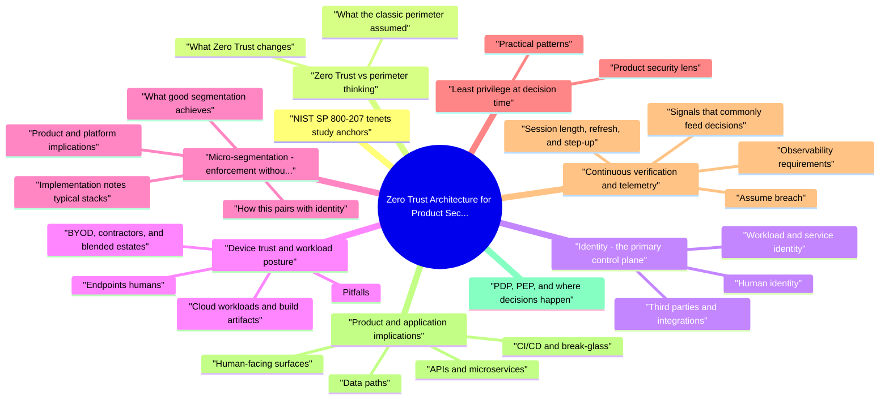

# Zero Trust Architecture for Product Security revision map

Last mock I bounced around the Zero Trust Architecture for Product Security folder. This file is the stop that. Drawn from Critical Clarification Zero Trust Architecture for Product Security Misconceptions.md, Zero Trust Architecture for Product Security - Comprehensive Guide.md, Zero Trust Architecture for Product Security - Interview Questions & Answers.md, Zero Trust Architecture for Product Security - Quick Reference.md. Skim the mermaid, then the outline.

## NIST SP 800-207 tenets (study anchors)
- NIST SP 800-207 §2.1 lists conceptual guidelines. Paraphrased here for preparation (read the standard for exact wording):
- All data sources and computing services are resources-including SaaS, partner systems, and sometimes non-enterprise-owned endpoints that touch enterprise data.
- All communication is secured regardless of network location: authenticate and protect traffic; do not treat "internal" as confidential-by-default.
- Access is granted per session or resource interaction-compromise or permission in one place must not silently grant another.
- Access is determined by dynamic policy from identity, asset state, behavior, and risk.
- The enterprise monitors asset security posture; non-compliant assets may be denied or limited.
- Authentication and authorization are strictly enforced before access, with re-evaluation where appropriate.
- Enterprise-wide telemetry improves detection, policy, and response.

## Zero Trust vs perimeter thinking

### What the classic perimeter assumed
- See the source section `What the classic perimeter assumed` for the worked example.

### What Zero Trust changes
- In interview language: the perimeter shrinks to each resource interaction-human login, API call, batch job, admin action-while the network remains an enforcement and containment layer.

## Identity: the primary control plane
- Identity is the anchor for humans, services, machines, and sometimes partners. Zero Trust implementations fail when teams invest in "Zero Trust networking" but leave APIs with weak or absent authorization.

### Human identity
- SSO with MFA; prefer phishing-resistant factors for privileged and high-impact actions.
- Session binding: tie sessions to device or context where practical; use step-up authentication when risk or sensitivity increases.
- Just-in-time (JIT) elevation for production and admin roles instead of long-lived superuser standing access.
- Clear lifecycle: joiner/mover/leaver, contractor expiry, and offboarding for integrated third-party IdPs.

### Workload and service identity
- Prefer workload identities (cloud workload identity, SPIFFE/SPIRE-style identities, mesh identities) over shared static secrets copied into many repos.
- Short-lived credentials, automatic rotation, and caller attribution in logs (which service principal called which API, on whose behalf).

### Third parties and integrations
- OAuth/OIDC with narrow scopes, vendor admin via PAM or JIT, and contractual clarity on data flows.
- Treat partner connectivity as another identity domain-not as "trusted pipe" that bypasses authZ.

## Device trust and workload posture
- Device and workload signals answer: is the client or runtime in an acceptable state to access this resource right now?

### Endpoints (humans)
- See the source section `Endpoints (humans)` for the worked example.

### Cloud workloads and build artifacts
- See the source section `Cloud workloads and build artifacts` for the worked example.

### Pitfalls
- Stale posture: checks that never update create false confidence.
- Signal without enforcement: collecting MDM data but never using it in policy.
- Availability: posture services down should have a defined degrade mode-not silent "allow all."
- Privacy and proportionality: over-collecting device signals for low-risk apps can create legal and cultural backlash; scope controls to sensitivity and regulatory context.

### BYOD, contractors, and blended estates
- See the source section `BYOD, contractors, and blended estates` for the worked example.

## Micro-segmentation: enforcement without implicit trust

### What good segmentation achieves
- Limits lateral movement after credential theft or RCE.
- Creates natural logging points at gateways, proxies, and mesh sidecars.
- Supports default-deny connectivity models between tiers (e.g., app tier cannot reach arbitrary admin APIs).

### Product and platform implications
- Customer-facing edge separated from internal admin and batch paths.
- Tenant isolation reinforced at the network layer where data stores could otherwise be reached broadly.
- Egress controls on sensitive workloads to constrain data exfiltration and SSRF blast radius.

### How this pairs with identity
- Segmentation answers "may this packet flow exist at all?" Fine-grained policy answers "given this authenticated identity, is this specific operation allowed?" Both matter; neither replaces the other.

### Implementation notes (typical stacks)
- Cloud: security groups, NACLs, private subnets, private link / VPC endpoints to keep traffic off the public internet.
- Kubernetes: NetworkPolicy to default-deny and allow explicit namespaces or labels.
- Mesh: mTLS plus L7 route policies; still requires application authZ for tenant and object scope.
- SaaS: admin IP allow lists are a weak substitute for SSO, MFA, and audit-use network constraints as supplement, not proof of trust.

## Least privilege at decision time
- Least privilege in a Zero Trust context is not a one-time IAM project. It is continuous alignment between what a subject needs and what policy grants, evaluated per session or per request where feasible.

### Practical patterns
- Role explosion control: prefer composable roles, attribute-based constraints (tenant, environment, resource ID), and regular access reviews.
- Standing privilege reduction: break-glass accounts, JIT, time-bound grants.
- API-level authorization: resource/action checks, not only "user is logged in."
- Service policies: which service identities may call which routes or queues; deny-by-default between services.

### Product security lens
- Customer data paths need tenant-scoped authZ (prevent IDOR and cross-tenant access). Internal tools need the same discipline-admin APIs are high-value targets.

## Continuous verification and telemetry

### Signals that commonly feed decisions
- Authentication events, location and device changes, impossible travel, token replay attempts.
- Policy engine denials and unusual patterns of allow/deny.
- Workload and posture changes (new deployment, image drift).

### Observability requirements
- Operational caveat: central policy infrastructure can become an availability choke point. Design caching semantics, fallback behavior, and SLOs explicitly; load-test authZ hot paths.

### Session length, refresh, and step-up
- See the source section `Session length, refresh, and step-up` for the worked example.

### Assume breach
- See the source section `Assume breach` for the worked example.

## Product and application implications
- Zero Trust shows up in concrete product features and engineering practices, not only in "security architecture" slides.

### Human-facing surfaces
- Admin consoles behind SSO, MFA, device posture where appropriate, and per-action authorization for destructive operations.
- Audit trails for billing, data export, permission changes, and impersonation (support) flows.

### APIs and microservices
- Default deny between services; explicit allow lists for callers, methods, and routes.
- Rate limiting, abuse detection, and structured audit on sensitive endpoints.
- Workload identity for service-to-service calls; avoid "if you are in the mesh you can call anything."

### Data paths
- Encryption in transit and at rest, tenant isolation in multi-tenant designs, and logging of data access tied to identities (human and service).
- Classification (even coarse) so policy intensity matches PII, secrets, and financial data.

### CI/CD and break-glass
- Pipeline identities with minimal scopes; signed artifacts and deployment policies.
- Break-glass with time bounds, approval, and mandatory audit-not shared root passwords.

### Customer-facing vs internal "trust"
- See the source section `Customer-facing vs internal "trust"` for the worked example.

## PDP, PEP, and where decisions happen

## Migration without freezing the product
- Inventory critical data flows, admin paths, high-risk APIs, and third-party integrations.
- Quick wins: MFA everywhere, eliminate VPN-only assumptions for critical apps, narrow IAM roles, add service auth on the highest-risk internal edges first.
- Platform use: one gateway or mesh policy model beats twelve incompatible team-specific checks-provided governance avoids policy sprawl.
- Progressive rollout: shadow mode -> enforce with exceptions -> tighten; canary policy changes.
- Operational safety: runbooks for lockouts, break-glass, rollback; train on-call on auth incidents.

## Common anti-patterns
- "We bought Zero Trust" without fixing IAM hygiene, API authZ, logging, or data controls-marketing replaces architecture.
- Network segmentation mistaken for trust: "They cannot reach that subnet" treated as "they are not a threat."
- AuthZ gap: strong identity and mTLS, but no per-resource authorization-IDOR and over-privileged tokens remain.
- Policy sprawl: thousands of rules, no owners, permanent exceptions-denials become unexplainable and changes become dangerous.
- Single point of failure: policy engine or IdP outage paralyzes the company-no degrade strategy or break-glass.
- Friction without partnership: mandates that ignore CI/CD and on-call reality; developers route around controls.
- False precision: complex ABAC before basic RBAC and tenant scoping are correct-complexity hides bugs.
- Shadow admin: shared break-glass or emergency accounts without checkout, rotation, and alerting-they become permanent backdoors.

### Mitigations (pattern -> response)
- See the source section `Mitigations (pattern -> response)` for the worked example.

## Metrics that matter
- Coverage: share of critical services behind workload identity and explicit authZ; admin actions behind step-up and posture where required.
- Privilege: reduction in standing broad roles; JIT usage versus permanent admin.
- Blast radius: lateral movement exercises blocked; reduced permissive east-west connectivity.
- Detection: correlated policy denials and alerts; time to detect credential misuse.
- Resilience: SLOs and incident counts for identity and policy dependencies.

## One-line positioning for interviews

## Interview clusters (how topics show up)
- Fundamentals: one-sentence definition; perimeter vs Zero Trust; VPN limitations.
- Senior: map NIST tenets or pillars to something you shipped; explain PDP/PEP in your environment; device posture tradeoffs.
- Staff: migration from flat connectivity to explicit service auth without stalling launches; resilience of centralized policy; metrics for leadership.

## Flags I check in 90 seconds

## Definition (NIST SP 800-207)
- ZT moves defenses from static network perimeters to users, assets, and resources. No implicit trust from network location or ownership; auth + authZ before sessions; protect resources, not "trusted intranets."

## Tenets (study anchors)
- All services/data stores are resources subject to policy.
- Secure all communications (encrypt + authenticate); internal ≠ trusted.
- Per-session / per-request access decisions; no silent lateral trust.
- Dynamic policy from identity, posture, risk, resource attributes.
- Monitor posture; non-compliant assets limited or blocked.
- Strict, continuous authentication/authorization as appropriate.
- Telemetry for detection and improvement.

## Roadmap pillars (common industry framing)
- Identity · Device · Network/Environment · Application/Workload · Data - e.g. CISA ZTMM. Use for planning; align to NIST definitions when precision matters.

## Product security checklist

## Architecture vocabulary
- PDP: decides (policy engine)
- PEP: enforces (gateway, mesh, firewall, app)
- IdP: identities; signals: posture, risk, device health

## Metrics (executive-friendly)
- Critical-path coverage (identity + authZ)
- Standing privilege down; JIT up
- Policy deny signal quality; incident MTTD for credential abuse
- Blast radius tests / red-team findings closed

## Pitfalls
- Policy sprawl · AuthZ gaps · Auth outage risk · "Vendor Zero Trust" without IAM/data fixes

## One-liner
- Explicit trust per request-identity, least privilege, telemetry-network contains, it does not vouch.

## Misreads that still sneak in

## "Zero trust is a vendor product."
- Reality: It is an architecture and operating model (verify explicitly, least privilege, assume breach)-tools implement pieces, not the whole.

## "VPN replacement equals zero trust."
- Reality: VPNs gate network entry; ZT emphasizes per-request policy using identity, device posture, and app context-not just tunnel shape.

## "mTLS everywhere finishes zero trust."
- Reality: Strong transport identity helps, but without authorization, telemetry, and lifecycle governance, service accounts still over-privilege.

## "Zero trust means zero network segmentation."
- Reality: Micro-segmentation and software-defined perimeters are common ZT patterns-segmentation doesn't disappear, it becomes policy-driven.

## "Internal traffic is trusted by default in ZT."
- Reality: East-west inspection and service identity are explicit goals-"inside" the VPC is not implicitly safe.

## "We implemented ZT because we use an IdP."
- Reality: SSO is one pillar; device trust, continuous authorization, and data protection layers still matter.

## "Zero trust removes need for patching."
- Reality: Assume breach means contain blast radius-not ignore vulnerabilities; patch velocity still counts.

## "ZT is only for cloud-native companies."
- Reality: Hybrid patterns (legacy DC, mainframe front doors) adopt ZT principles incrementally-journey, not flip switch.

## "Policy engine purchase = continuous authorization."
- Reality: Policy quality ( roles, attributes, risk signals) and observability determine outcomes-engines encode decisions you must define.

## "Users will hate zero trust UX."
- Reality: Step-up auth and device compliance friction drops when paired with passwordless and transparent device health-design matters.

## Clusters from the Q&A file

- What is Zero Trust in one precise sentence?
- How is Zero Trust different from classic perimeter security?
- Is Zero Trust the same as replacing a VPN with ZTNA?
- Is "never trust, always verify" literal?
- What pillars do people use when building Zero Trust roadmaps?
- Identity, device trust, and continuous verification
- Why is authorization as important as authentication in Zero Trust?
- What signals do you use for device trust, and where does it break down?
- What does "continuous verification" mean in a product?
- How does workload identity support Zero Trust for microservices?
- Segmentation, architecture, and least privilege
- What is micro-segmentation's role if the network is not "trusted"?
- Explain Policy Decision Point (PDP) and Policy Enforcement Point (PEP).
- Is mTLS sufficient for Zero Trust between services?
- How do you operationalize least privilege without blocking every launch?
- Product security and migration
- How does Zero Trust apply to customer-facing APIs?
- How would you migrate from a flat internal network to something closer to Zero Trust without stalling the product?
- What operational failures show up most often after centralizing access decisions?
- Leadership, vendors, and curveballs
- How do you partner with platform and product teams on Zero Trust?
- What is your stance on "Zero Trust products" from vendors?
- Give two realistic non-goals for a Zero Trust program.
- How do you prove progress to leadership without vendor checklist theater?

## Fundamentals

### Is "never trust, always verify" literal?
- Senior angle: Tie the phrase to NIST tenets (dynamic policy, telemetry) and to product reality: you still ship features; you scope controls to assets and flows that matter.

### What does "continuous verification" mean in a product?
- See the source section `What does "continuous verification" mean in a product?` for the worked example.

### What is micro-segmentation's role if the network is not "trusted"?
- Example stack: Kubernetes NetworkPolicy default-deny between namespaces, plus a mesh that requires mTLS for east-west, plus application authZ that checks tenant_id on each query-three layers, three different jobs.

### What is your stance on "Zero Trust products" from vendors?
- See the source section `What is your stance on "Zero Trust products" from vendors?` for the worked example.

## Depth: quick reference for follow-ups
- Authoritative references: NIST SP 800-207; CISA Zero Trust Maturity Model.
- High-yield follow-up themes: identity as the primary perimeter; segmentation as supplement; continuous or repeated evaluation vs one-time VPN; PDP/PEP vocabulary tied to your stack; authZ as the common gap.

## Cross-links I actually follow

- Stay inside this folder for the long guide. Jump only when a section names a sibling topic.
- Cookie Security, CSRF, XSS, JWT, OAuth, and TLS show up as neighbors on a lot of these maps.
