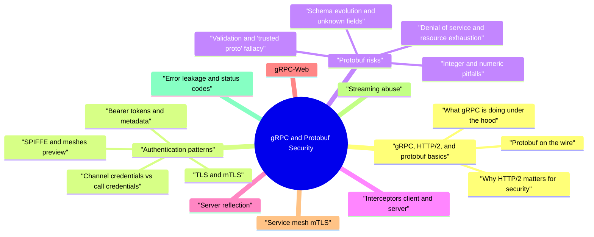

# gRPC and Protobuf Security revision map

Last mock I bounced around the gRPC and Protobuf Security folder. This file is the stop that. Drawn from Critical Clarification gRPC and Protobuf Security Misconceptions.md, gRPC and Protobuf Security - Comprehensive Guide.md, gRPC and Protobuf Security - Interview Questions & Answers.md, gRPC and Protobuf Security - Quick Reference.md. Skim the mermaid, then the outline.

## gRPC, HTTP/2, and protobuf basics

### What gRPC is doing under the hood
- A gRPC client opens a long-lived HTTP/2 connection to a server. Each RPC is mapped to an HTTP/2 request:
- :method is POST.
- :path encodes the fully qualified service and method, e.g. /my.package.MyService/MyMethod.
- :content-type is application/grpc (or application/grpc+proto in some stacks).
- Message bodies are length-prefixed protobuf frames (the gRPC framing layer adds a compression flag and length).

### Why HTTP/2 matters for security
- Header compression (HPACK) and long-lived connections can amplify certain DoS and fingerprinting considerations; most teams rely on proxy/sidecar defaults plus explicit limits rather than custom HPACK tuning.
- TLS with ALPN negotiates h2. Misconfiguration (TLS off, wrong ALPN, HTTP/1.1-only frontends) is a common deployment footgun, not a "grpc bug."

### Protobuf on the wire
- Protobuf encodes field numbers + wire types, not JSON keys. The .proto file is a schema contract; generated code marshals and unmarshals binary payloads.

## Authentication patterns

### TLS and mTLS
- TLS (one-way): server presents a certificate; client verifies. Protects confidentiality and integrity on the path and gives server identity to the client.
- mTLS: both client and server present certificates. Common for service-to-service identity, especially with SPIFFE/SPIRE-style workload IDs in Kubernetes.

### Bearer tokens and metadata
- gRPC carries metadata (key/value pairs) alongside each RPC-conceptually like HTTP headers. A common pattern is authorization: Bearer (exact header names vary by convention and library).
- Validate signature, issuer, audience, lifetime, and intended use (e.g. not accepting an access token where you need a step-up token).
- Authorize per RPC after authentication. A valid token for user A must not access user B's resource just because the RPC reached an internal service.

### Channel credentials vs call credentials
- This distinction shows up constantly in gRPC APIs:
- Call credentials attach per-RPC credentials-typically OAuth tokens or JWTs added to metadata on each call. Think: "what delegation or user context applies to this invocation?"

### SPIFFE and meshes (preview)
- See the source section `SPIFFE and meshes (preview)` for the worked example.

## Protobuf risks

### Denial of service and resource exhaustion
- Protobuf parsing is generally efficient, but application-level DoS remains easy:
- Huge messages or deeply nested structures (especially with recursive message shapes or JSON transcoding feeding protobuf) can exhaust CPU or memory.
- Many small RPCs on one HTTP/2 connection can exhaust streams or worker threads if handlers block.
- Enforce max message size on servers and clients (and at envoy/sidecar if used).
- Use deadlines/timeouts on every RPC; cancel work when the client disconnects when possible.
- Apply rate limits and concurrency limits per identity and method.
- For public or multi-tenant APIs, consider separate gateway limits from internal mesh limits.

### Schema evolution and unknown fields
- Protobuf supports forwards and backwards compatibility when teams follow rules: never reuse field numbers, prefer additive changes, understand optional, repeated, oneof, and map semantics.
- Defense: treat proto changes like API changes: review for authZ impact, maintain compatibility tests, and use lint/breaking-change detection in CI (buf breaking, etc.).

### Validation and "trusted proto" fallacy
- Use explicit validation (custom code, protoc-gen-validate, or equivalent) for security-sensitive fields, and fail closed when validation fails.

### Integer and numeric pitfalls
- See the source section `Integer and numeric pitfalls` for the worked example.

## Interceptors (client and server)
- Interceptors wrap RPCs and are the idiomatic place for cross-cutting security:
- Server-side: parse/validate metadata, authenticate, build request context, enforce authorization, attach audit fields, enforce redaction in logs.
- Client-side: inject tokens, trace context, deadlines, and retry policy (with care-retries and non-idempotent RPCs are risky).
- Ordering: authentication before authorization; avoid logging raw tokens.
- Streaming: interceptors must handle unary vs client-streaming vs server-streaming vs bidi; half-close behavior differs.
- Bypass: ensure every path through the server runs the same interceptor chain (no "admin port" without the same checks).

## Server reflection
- gRPC Server Reflection lets tools (e.g. grpcurl, some IDEs) discover services and message types at runtime.
- Reconnaissance: exposes service/method names and descriptor information to anyone who can reach the endpoint.
- Accidental exposure when a debug flag ships enabled in production.
- Disable in production by default; if enabled, restrict by network (admin VPC), mTLS identity, or separate admin listener.
- Prefer schema distribution via Buf Schema Registry, Git, or packages for developers.

## gRPC-Web
- gRPC-Web allows browser clients to speak a gRPC-compatible protocol, usually through a gateway (Envoy, grpcwebproxy, etc.) because browsers have limited HTTP/2 and no raw access for typical gRPC.
- Browsers cannot hold service client certificates the same way backends do; user auth is usually OAuth/OIDC with CORS and CSRF considerations on cookie-based flows.
- Terminate TLS at a controlled edge; do not expose raw gRPC ports to the public internet without WAF/gateway policy.
- Treat the gateway as a trust pivot: validate tokens at the edge and re-issue internal identity or forward only signed, short-lived internal assertions-never blindly forward x-user-id headers from the browser.

## Service mesh mTLS
- Meshes (Istio, Linkerd, etc.) often provide transparent mTLS between pods via sidecars.
- What mesh mTLS gives you: strong workload-to-workload encryption and stable identities for L4/L7 policy.
- Certificate rotation and trust bundle updates can cause outages if not staged.
- Ambiguous identity when multiple services share a poorly scoped SPIFFE ID.

## Streaming abuse
- Streaming RPCs (client streaming, server streaming, bidirectional) enable low-latency and bulk workflows but change abuse dynamics:
- A client can hold a stream open indefinitely, sending slow trickle data-exhausting goroutines, memory buffers, or connection quotas.
- A server can over-send on a server stream if there is no backpressure awareness.
- Idle timeouts on streams; max stream duration where appropriate.
- Per-stream byte counters and message count limits.
- Deadlines and cancellation propagated through the stack.
- At the proxy: route-specific timeouts and rate limits where supported.

## Error leakage and status codes
- gRPC surfaces errors as status codes plus details payloads (often google.rpc.Status with ErrorInfo, RetryInfo, etc.).
- Returning internal exception messages, SQL fragments, or stack traces in details leaks implementation to clients-especially dangerous for public APIs.
- Different error codes or timing on authorization vs not-found can create enumeration channels (classic IDOR fingerprinting).
- Map internal failures to coarse external statuses; log rich detail server-side only.
- Use consistent "not found" responses for unauthorized access to objects when product policy requires it.
- Audit localization and client SDK behavior-some auto-attach metadata you did not intend.

## Gateway security (REST/JSON transcoding)
- Many teams expose REST + JSON via grpc-gateway, Envoy gRPC-JSON transcoder, or cloud API gateways.
- Confused deputy: the gateway trusts headers from the edge without cryptographic binding.
- SSRF / routing misconfigurations that reach internal gRPC backends from public HTTP paths.
- AuthZ gap where HTTP path templates map to gRPC methods without matching fine-grained rules.
- Authenticate at the gateway, then propagate a signed internal token or mTLS to upstreams.
- Path and method allowlists; disable dangerous reflection on upstream clusters.
- Separate public and internal gateway deployments with different policies.
- WAF/bot protections at the edge where applicable.

## Deadlines, cancellation, retries, and idempotency
- gRPC encourages every call to carry a deadline (client-side timeout propagated as timeout metadata). From a security and reliability angle, deadlines limit resource pinning by slow or malicious peers.
- Cancellation should stop expensive work-database queries, fan-out calls, and stream processing-when the client gives up. Otherwise you pay CPU for results nobody consumes, which becomes a DoS lever.

## Observability, logging, and tracing
- Metadata is easy to log accidentally. Authorization headers, internal forwarded claims, and trace headers can contain PII or secrets. Standardize redaction in interceptors and at ingress.
- Distributed tracing across gRPC is powerful for incident response, but span attributes can leak tenant IDs, email addresses, or free-text search queries. Apply the same data classification rules you use for HTTP.

## Supply chain: codegen, plugins, and dependencies
- The protobuf ecosystem relies on protoc, language plugins, and generated source. Compromised plugins or pinned-but-vulnerable toolchains can inject backdoors into otherwise benign services.
- Pin tool versions in CI; verify checksums where your organization requires it.
- Treat generated directories as build outputs with review when codegen changes.
- Use dependabot-style updates for gRPC runtime libraries; outdated C++/Java/Go cores sometimes carry known CVEs.

## Identity propagation and confused deputy prevention
- In multi-hop service graphs, security failures often come from identity mixing:
- Edge authenticates the user, but internal services trust unsigned forwarded headers.
- A privileged service calls downstream APIs on behalf of a user without explicit delegation boundaries.
- A downstream service treats "caller service identity" as equivalent to "end-user identity."
- Preserve workload identity (mTLS/SPIFFE) separately from user identity.
- Use short-lived, signed delegation tokens for user context at each hop.
- Bind token audience to the next hop service (no broad reuse).
- Enforce authZ on both dimensions: "which service is calling" and "for which subject/tenant."

## Long-lived streams and auth lifecycle
- Streaming sessions can outlive token validity and policy state:
- Access token expires while bidi stream remains open.
- User/role is revoked, but existing stream keeps receiving events.
- Gateway rotates signing keys while downstream stream sessions still trust old claims.
- Hard max stream lifetime shorter than token/session lifetime.
- Mid-stream revalidation checkpoints for high-risk channels.
- Disconnect or downgrade stream permissions on revocation events.
- Versioned key rotation strategy with short overlap windows and explicit validation of kid + issuer metadata.

## How it fails (quick reference)

## Safe-by-design checklist
- TLS everywhere for production; mTLS for east-west where policy demands; short-lived credentials.
- Authenticate and authorize every RPC-including health and reflection if exposed.
- Channel credentials for transport; call credentials for delegation; document propagation across hops.
- Max receive/send sizes, deadlines, rate limits, stream timeouts.
- Interceptors for consistent auth, audit, metrics, and redaction.
- Reflection off in prod unless justified and segmented.
- gRPC-Web / gateway treated as a security choke point with minimal trust in client-supplied metadata.
- Proto evolution reviewed for authZ impact; breaking-change detection in CI.

## Verification and testing
- Negative tests: missing token, wrong audience, expired token, cross-tenant IDs, oversized payloads, slow streams.
- Fuzzing protobuf parsers and transcoding layers for crashes and hangs.
- Observability: SPIFFE ID or client cert fingerprint in audit logs; no secrets in logs.
- Chaos: cert rotation, gateway failover-ensure fail closed defaults.

## Interview clusters
- Beginner: HTTP/2 path format, where JWTs go, what reflection does.
- Mid: channel vs call credentials, interceptor ordering, message size limits.
- Senior: gateway trust model, streaming DoS, protobuf evolution vs authZ.
- Staff: end-to-end identity from browser to database, blast-radius with mesh and multi-cluster, policy-as-code at scale.

## Cross-links
- TLS, Zero Trust / IAM, GraphQL and API Security (gateway parallels), Rate Limiting, Container/Kubernetes Security, Software Supply Chain.

## Authoritative references (verify versions)
- gRPC Authentication guide
- gRPC guides (deadlines, errors, wire format concepts)
- Protocol Buffers documentation
- SPIFFE (workload identity)
- Envoy gRPC / transcoding docs (for gateway deployments)

## Flags I check in 90 seconds

## Core
- HTTP/2 + protobuf; often mTLS in mesh.
- Metadata = headers analog; must validate per RPC.
- Reflection exposes schema -> usually off in prod or network-restricted.

## Must not say
- "mTLS = trusted" - still need authZ every method.
- "Protobuf = safe" - logic bugs and confused deputy remain.

## Defenses (priority)
- mTLS + short-lived certs / SPIFFE IDs
- AuthZ interceptors / policy per RPC
- Message size limits, timeouts, stream abuse controls
- Toolchain + generated code in supply chain reviews

## Hot prompts
- Stolen client cert -> attacker is a "service."
- Metadata must not set identity without crypto proof.

## Cross-links
- TLS, Zero Trust, IAM, GraphQL gateway comparison, Rate Limiting.

## Misreads that still sneak in

## "mTLS means the service is authenticated"
- Truth: mTLS authenticates peers at the transport layer. You still need application-level authorization for what each RPC is allowed to do-otherwise a compromised legitimate client is still powerful.

## "Protobuf is encrypted"
- Truth: Protobuf is a serialization format. Confidentiality comes from TLS (or application encryption)-not from protobuf itself.

## "Internal gRPC doesn't need authZ"
- Truth: Lateral movement after compromise is exactly why service identity + authZ matter on internal RPCs-zero trust between services.

## "Reflection is harmless"
- Truth: Reflection aids attackers and competitors mapping your API-treat like GraphQL introspection: environment and network controls.

## Clusters from the Q&A file

- In one minute, what is gRPC and how does it relate to HTTP/2 and protobuf?
- What are channel credentials versus call credentials in gRPC?
- How would you authenticate gRPC between two microservices?
- Why is "we use mTLS internally, so we are secure" incomplete?
- What security risks does protobuf introduce compared to JSON APIs?
- How do unknown fields and backward-compatible proto changes affect security?
- What is gRPC server reflection and when should it be disabled?
- How do interceptors help security, and what can go wrong?
- What abuse scenarios matter for gRPC streaming RPCs?
- What should you know about gRPC-Web from a security perspective?
- How does a service mesh change the gRPC threat model?
- What errors should gRPC servers return to clients, and what should they avoid leaking?
- What are the main security pitfalls of REST/JSON gateways in front of gRPC?
- Where do JWTs live in gRPC, and what validation is mandatory?
- How do you test gRPC security in CI beyond unit tests?
- As a staff engineer, how would you design identity from a browser client to an internal gRPC service?
- What is HPACK / HTTP/2 header handling relevance for gRPC security?
- How does protobuf schema governance reduce incidents?
- Depth: Interview follow-ups - gRPC and Protobuf Security

### Why is "we use mTLS internally, so we are secure" incomplete?
- See the source section `Why is "we use mTLS internally, so we are secure" incomplete?` for the worked example.

## Depth: Interview follow-ups - gRPC and Protobuf Security
- Authoritative references: gRPC Authentication; SPIFFE; NIST SP 800-204B.
- Production verification: Mesh/sidecar audits; log authZ denials; redact secrets in logs.

## Cross-links I actually follow

- Stay inside this folder for the long guide. Jump only when a section names a sibling topic.
- Cookie Security, CSRF, XSS, JWT, OAuth, and TLS show up as neighbors on a lot of these maps.
